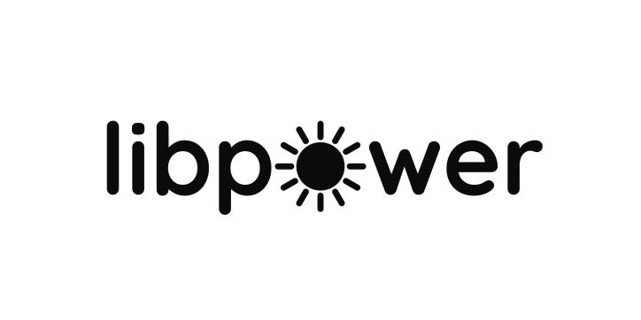

    

    &nbsp;
    &nbsp;
    &nbsp;
    &nbsp;
    &nbsp;

<h3>About the project</h3>

libpower is a Rust library containing algorithms commonly used in power electronics systems, targeted for use in embedded systems

<h3>References</h3>

+ [Texas Instruments Solar library](https://e2e.ti.com/cfs-file/__key/communityserver-discussions-components-files/171/SolarLib.pdf)

+ [GitHub/pms67](https://github.com/pms67)
